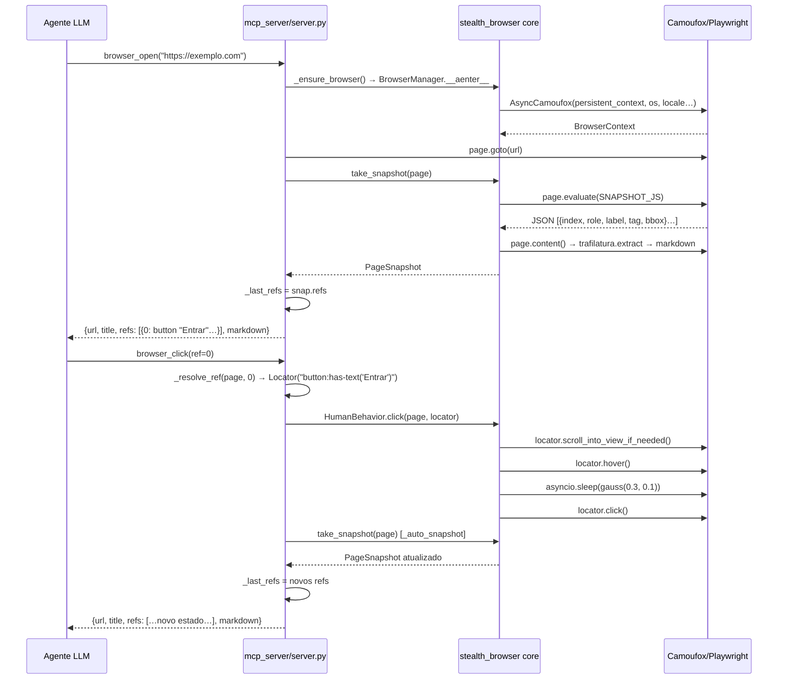
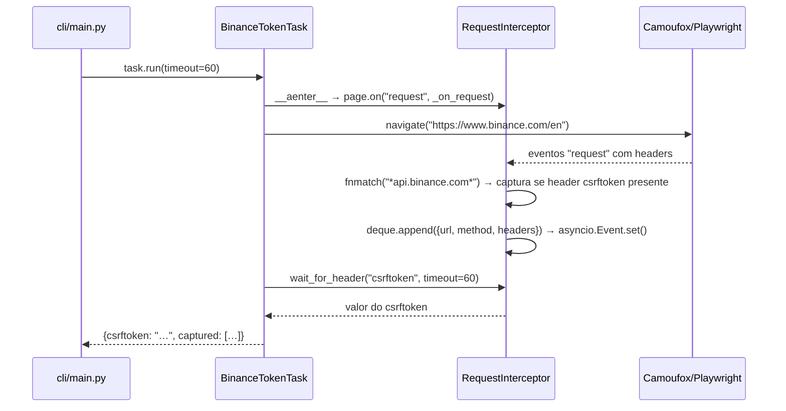

# Arquitetura — automation-stealth

> Versão documentada: `0.1.0` · Python ≥ 3.11 · Camoufox + Playwright + MCP

---

## 1. Visão geral

`automation-stealth` é um framework de automação de browser com foco em anti-detecção. O propósito central é permitir que agentes de IA (ou scripts diretos) controlem um browser de forma indistinguível de um usuário humano, contornando sistemas de detecção de bots como fingerprinting de canvas/WebGL, WebRTC leaks, análise de timing e padrões de input sintético.

**Stack principal:**

| Camada | Tecnologia |
|---|---|
| Motor de browser | [Camoufox](https://github.com/daijro/camoufox) (Firefox modificado com patches anti-fingerprint) |
| API de automação | Playwright (async) |
| Protocolo de integração com LLMs | MCP via `mcp[fastmcp]` |
| Interface de linha de comando | Click |
| Extração de texto | Trafilatura (HTML → Markdown) |
| Importação de cookies reais | Chrome DevTools Protocol (CDP) |

O framework expõe três superfícies de uso: CLI (`stealth-browser`), servidor MCP (`stealth-browser-mcp`) e API Python direta via `BrowserManager` + `BaseTask`.

---

## 2. Diagrama de camadas

```mermaid
graph TD
    subgraph Superfícies de uso
        CLI["CLI\ncli/main.py\n(open-page, binance-tokens, monitor)"]
        MCP["Servidor MCP\nmcp_server/server.py\n(17 tools via FastMCP)"]
        API["API Python direta\n(BrowserManager + BaseTask)"]
    end

    subgraph Camada de Tarefas
        BASE["BaseTask\ntasks/base.py"]
        BINANCE["BinanceTokenTask\ntasks/trading/binance.py"]
        MONITOR["PageMonitorTask\ntasks/scraping/monitor.py"]
        FORM["FormFillTask\ntasks/productivity/forms.py"]
        INSTA["InstagramTask\ntasks/social/instagram.py\n(placeholder)"]
    end

    subgraph stealth_browser — Core
        BM["BrowserManager\nbrowser.py"]
        CFG["BrowserConfig\nconfig.py"]
        HUM["HumanBehavior\nhumanize.py"]
        SNAP["take_snapshot / PageSnapshot\nsnapshot.py"]
        PGOPS["page_ops.py\n(navigate, fill, screenshot…)"]
        SESS["session.py\n(cookies, localStorage)"]
        INT["RequestInterceptor\nintercept.py"]
        CHR["chrome_import.py\n(CDP cookie extractor)"]
        ERR["errors.py\n(hierarquia de exceções)"]
    end

    subgraph Camada de browser
        CAMOUFOX["Camoufox\n(Firefox + patches stealth)"]
        PW["Playwright async API"]
    end

    CLI --> BASE
    CLI --> BM
    MCP --> BM
    MCP --> SNAP
    MCP --> HUM
    API --> BASE
    BASE --> BINANCE & MONITOR & FORM & INSTA
    BINANCE --> INT
    MONITOR --> PGOPS
    FORM --> PGOPS
    BM --> CFG
    BM --> CHR
    BM --> CAMOUFOX
    CAMOUFOX --> PW
    PGOPS --> PW
    SNAP --> PW
    SESS --> PW
    INT --> PW
    HUM --> PW
```

---

## 3. Componentes principais (`stealth_browser/`)

### `browser.py` — `BrowserManager`

Gerenciador de ciclo de vida do browser. Implementa o protocolo de context manager assíncrono (`__aenter__` / `__aexit__`).

**Responsabilidades:**
- Instanciar `AsyncCamoufox` com os parâmetros de configuração (perfil persistente, locale, janela, OS spoofing, proxy, cache).
- Importar cookies do Chrome (via `chrome_import`) antes de abrir o contexto, se `import_chrome_cookies=True`.
- Expor `get_page()` (retorna a primeira página existente ou abre uma nova) e `new_page()`.

**Classes/funções chave:**
- `BrowserManager.__aenter__` — lança Camoufox, injeta cookies Chrome se configurado.
- `BrowserManager.get_page() -> Page` — ponto de acesso primário à página ativa.

---

### `config.py` — `BrowserConfig`

Dataclass central de configuração. Todos os parâmetros têm valores padrão sensatos para uso stealth.

**Responsabilidades:**
- Centralizar todos os parâmetros de comportamento do browser e do humanizador.
- Carregar overrides de variáveis de ambiente via `BrowserConfig.from_env()`, que internamente chama `_load_dotenv()` para ler `.env` na raiz do projeto.

Ver seção 8 para a lista completa de variáveis de ambiente.

---

### `humanize.py` — `HumanBehavior`

Implementa comportamento de input indistinguível de humano usando distribuições estatísticas.

**Responsabilidades:**
- Simular timing gaussiano em digitação, cliques, hover e scroll.
- Implementar drag com interpolação linear + ruído gaussiano por passo.

**Métodos chave:**

| Método | Comportamento |
|---|---|
| `delay(mean, std, minimum)` | `asyncio.sleep` com `random.gauss` |
| `lognormal_delay(mean, std)` | Sleep com distribuição log-normal (cauda longa) |
| `type_text(page, text)` | Caractere a caractere, CPS gaussiano, pausas inter-palavra, hesitações aleatórias |
| `scroll(page, pixels)` | 3–6 passos de scroll, delta gaussiano por passo, sleep entre passos |
| `click(page, locator)` | `scroll_into_view` → `hover` → sleep gaussiano → `click` |
| `hover(page, locator)` | `hover` + sleep gaussiano |
| `drag(page, source, target)` | Bounding boxes → 8 passos de interpolação linear + ruído gaussiano ±2px por passo |

---

### `snapshot.py` — `take_snapshot` / `PageSnapshot` / `RefElement`

Implementa o sistema de snapshot que é a base da interface LLM ↔ browser.

**Responsabilidades:**
- Executar `SNAPSHOT_JS` na página via `page.evaluate`: enumera todos os elementos interativos visíveis no viewport (links, botões, inputs, selects, roles ARIA), filtra elementos com bbox zero ou fora do viewport (tolerância de 100px), deduplica por chave `role:label:x:y`, e retorna lista indexada de objetos `{index, role, label, tag, bbox}`.
- Extrair texto como Markdown via Trafilatura (em thread separada para não bloquear o event loop).
- Capturar screenshot como base64 PNG (opcional).

**Classes/funções chave:**
- `RefElement` — dataclass representando um elemento interativo com índice, role, label, tag e bbox.
- `PageSnapshot` — dataclass agregando URL, título, lista de refs, markdown e screenshot opcional. Expõe `to_dict()` (serialização completa) e `to_llm_text(max_chars)` (formato compacto para LLMs).
- `take_snapshot(page, include_screenshot, include_markdown) -> PageSnapshot`

---

### `page_ops.py` — Operações de página

Funções utilitárias avulsas que encapsulam operações Playwright com tratamento de erros específico do framework.

**Funções chave:**

| Função | Descrição |
|---|---|
| `navigate(page, url, wait_until, timeout)` | `page.goto` com conversão de `PlaywrightTimeoutError` → `NavigationTimeout` |
| `wait_for_selector(page, selector, timeout)` | Aguarda locator com conversão → `ElementNotFound` |
| `screenshot(page) / screenshot_b64(page)` | PNG bytes / base64 |
| `extract_text(page)` | HTML → Markdown via Trafilatura em thread |
| `get_cookies / set_cookies` | Acesso ao context de cookies |
| `evaluate(page, js)` | `page.evaluate` direto |
| `fill(page, selector, value, human)` | Preenche campo — com `HumanBehavior.type_text` se `human` fornecido, ou `locator.fill` direto |
| `select_option(page, selector, value)` | `locator.select_option` |

---

### `session.py` — Persistência de sessão

Funções para persistir e restaurar estado de autenticação entre execuções.

**Funções chave:**
- `save_cookies(page, path)` — serializa cookies do contexto em JSON.
- `load_cookies(page, path)` — carrega cookies de arquivo JSON no contexto.
- `export_storage(page, origin) -> dict` — navega para `origin` se necessário, exporta `localStorage` e `sessionStorage`.
- `import_storage(page, origin, data)` — restaura `localStorage` e `sessionStorage` via `page.evaluate`.

---

### `intercept.py` — `RequestInterceptor`

Context manager assíncrono para captura passiva de requisições HTTP da página.

**Responsabilidades:**
- Registrar listener no evento `request` do Playwright, filtrando por glob de URL e por presença de headers específicos.
- Manter buffer circular de até 500 requisições capturadas (`collections.deque(maxlen=500)`).
- Sinalizar novos dados via `asyncio.Event` para polling eficiente.

**Métodos chave:**
- `attach() / detach()` — registra/remove listener.
- `wait_for_header(header_name, timeout) -> str` — aguarda até que um header específico apareça em qualquer requisição capturada; usa `asyncio.timeout` com loop de polling sobre o deque.

---

### `errors.py` — Hierarquia de exceções

Ver seção 7.

---

### `chrome_import.py` — `extract_chrome_cookies`

Extrator de cookies do Chrome via CDP, contornando a criptografia v20 app-bound do Chrome (que impede leitura direta do SQLite).

**Responsabilidades:**
- Fechar o Chrome se estiver rodando (via `taskkill`).
- Lançar Chrome headless com `--remote-debugging-port` em porta livre.
- Conectar via `playwright.chromium.connect_over_cdp` e enviar `Network.getAllCookies`.
- Converter formato CDP → formato Playwright (normalização de `sameSite`).
- Cachear resultado em `chrome_cookies_cache.json` no diretório de perfil com TTL configurável (padrão: 3600s).

**Nota:** implementação exclusiva para Windows (usa `tasklist` e `taskkill`, e os caminhos `PROGRAMFILES`/`AppData`).

---

## 4. Camada MCP (`mcp_server/server.py`)

O servidor MCP expõe 17 tools via `FastMCP("stealth-browser")`, permitindo que qualquer cliente MCP (incluindo agentes Claude) controle o browser.

### Estado global do servidor

```python
_manager: BrowserManager | None   # instância singleton do browser
_human: HumanBehavior | None       # instância singleton do humanizador
_last_refs: list[RefElement]       # refs do último snapshot
_lock: asyncio.Lock                # lock global de concorrência
```

O browser é inicializado sob demanda na primeira chamada via `_ensure_browser()`, que adquire `_lock` antes de verificar e instanciar.

### Decorator `@_mcp_tool`

Envolve todas as tools em tratamento de erro uniforme: qualquer exceção é capturada, logada com `exc_info=True` e convertida em `{"error": str(e), "tool": fn.__name__}` — garantindo que o cliente MCP sempre receba um dict serializável em vez de uma exceção.

### Sistema de refs/snapshot

Cada ação que modifica o estado da página chama `_auto_snapshot(page)`, que:
1. Adquire `_lock`.
2. Chama `take_snapshot(page)`.
3. Atualiza `_last_refs` com os refs do novo snapshot.
4. Retorna o dict do snapshot.

A resolução de ref para locator (`_resolve_ref(page, ref: int) -> Locator`) funciona assim:
- Valida que `ref` está dentro do intervalo de `_last_refs`.
- Se o elemento tem `label`, cria locator `tag:has-text("label")` (com escape de aspas).
- Caso contrário, cria locator por `tag` simples.
- Sempre usa `.first` para evitar ambiguidade.
- Lança `RefStale` se o índice é inválido.

### Inventário das 17 tools

| Tool | Parâmetros | Descrição |
|---|---|---|
| `browser_open` | `url: str` | Navega e retorna snapshot |
| `browser_snapshot` | `include_screenshot: bool` | Snapshot da página atual |
| `browser_screenshot` | — | PNG base64 da página |
| `browser_navigate_back` | — | `go_back()` + snapshot |
| `browser_refresh` | — | `reload()` + snapshot |
| `browser_click` | `ref: int` | Click humanizado via ref |
| `browser_type` | `ref: int, text: str, clear_first: bool` | Digitação humanizada via ref |
| `browser_select` | `ref: int, value: str` | Seleciona opção em `<select>` |
| `browser_hover` | `ref: int` | Hover humanizado via ref |
| `browser_scroll` | `direction: str, pixels: int` | Scroll humanizado |
| `browser_press_key` | `key: str` | Pressiona tecla (ex: `Enter`, `Tab`) |
| `browser_get_text` | — | Texto da página como Markdown |
| `browser_get_cookies` | — | Lista de cookies do contexto |
| `browser_evaluate` | `js: str` | Executa JavaScript arbitrário |
| `browser_save_session` | `name: str` | Salva cookies em arquivo nomeado |
| `browser_load_session` | `name: str` | Restaura cookies de arquivo nomeado |
| `browser_close` | — | Fecha browser e limpa estado |

### Lock de concorrência

`_lock` é um `asyncio.Lock` único. `_ensure_browser` e `_auto_snapshot` o adquirem para operações de leitura/escrita no estado global. Isso serializa operações concorrentes de múltiplos clients MCP, mas garante consistência de `_last_refs`.

**Discrepância observada:** `browser_save_session` e `browser_load_session` adquirem `_lock` antes de chamar `_ensure_browser`, que também tenta adquirir `_lock` internamente — isto causaria deadlock se `asyncio.Lock` não fosse reentrante. Na prática, `asyncio.Lock` não é reentrante, mas o deadlock não ocorre porque `_ensure_browser` só adquire o lock quando `_manager is None`. Na segunda chamada (manager já existe), o lock não é adquirido. Ainda assim, o padrão é frágil.

---

## 5. Modelo de stealth/anti-detecção

### Camoufox

O Camoufox é um fork do Firefox com patches que removem ou normalizam as principais superfícies de fingerprinting:

- **Canvas/WebGL fingerprint**: ruído controlado para tornar hashes não únicos.
- **navigator.platform / userAgent**: spoofado conforme o parâmetro `os` (`windows`, `macos`, `linux`).
- **Fonts e resolução de tela**: normalizados para reduzir entropia.
- **Automação flags**: remove propriedades como `navigator.webdriver`.

O parâmetro `humanize` do Camoufox ativa delays internos adicionais ao nível do browser engine.

### WebRTC blocking

`block_webrtc=True` (padrão) instrui o Camoufox a desabilitar WebRTC, prevenindo vazamento do IP real mesmo sob proxy.

### OS spoofing

`os_target` (padrão: `"windows"`) é passado diretamente ao Camoufox como parâmetro `os`, ajustando User-Agent, `navigator.platform` e heurísticas de fingerprint para o SO alvo.

### Perfil persistente

`persistent_context=True` + `user_data_dir` preservam cookies, localStorage, histórico e cache entre sessões, tornando o perfil mais "envelhecido" e menos suspeito.

### Humanização de input (`HumanBehavior`)

Todas as distribuições de timing são configuráveis via `BrowserConfig`:

| Parâmetro | Padrão | Descrição |
|---|---|---|
| `typing_cps_mean` | 4.5 | Caracteres por segundo (média) |
| `typing_cps_std` | 1.2 | Desvio padrão do CPS |
| `typing_word_pause_mean` | 0.15s | Pausa extra após espaço (média) |
| `typing_word_pause_std` | 0.08s | Desvio da pausa inter-palavra |
| `typing_hesitation_prob` | 0.08 | Prob. de hesitação longa (0.8–2.5s) |
| `scroll_steps_min/max` | 3–6 | Número de passos de scroll |
| `click_hover_mean` | 0.3s | Tempo de hover antes do click (média) |
| `click_hover_std` | 0.1s | Desvio do hover |

O drag usa interpolação linear com 8 passos e ruído gaussiano de `σ=2px` por passo, simulando tremor de mão.

---

## 6. Fluxo de dados

### Exemplo: agente LLM clica em um botão via MCP



### Exemplo: captura de token Binance via intercept



---

## 7. Tratamento de erros

### Hierarquia de exceções (`stealth_browser/errors.py`)

```
Exception
└── BrowserError  (também exportado como AutomationError)
    ├── NavigationTimeout(url, timeout_ms)
    │     Lançado por: page_ops.navigate quando PlaywrightTimeoutError
    ├── ElementNotFound(selector)
    │     Lançado por: page_ops.wait_for_selector, humanize.drag (bounding box None)
    ├── PageCrashed(reason)
    ├── SessionExpired(detail)
    ├── RefStale(detail)
    │     Lançado por: mcp_server._resolve_ref quando ref fora do intervalo
    ├── BrowserLaunchError(reason)
    ├── CookieImportError(reason)
    ├── SnapshotError(reason)
    │     Lançado por: snapshot.take_snapshot quando JSON inválido
    └── JavaScriptError(js, reason)
```

**`AutomationError`** é um alias direto para `BrowserError` (não é subclasse), usado em `BinanceTokenTask` para sinalizar falha de captura de token.

### Propagação na camada MCP

O decorator `@_mcp_tool` captura qualquer `Exception` e retorna `{"error": str(e), "tool": fn.__name__}`. Isso significa que erros da hierarquia `BrowserError` chegam ao cliente MCP como dicts serializáveis, sem stack trace — o cliente LLM vê a mensagem de erro como texto.

---

## 8. Configuração

### `BrowserConfig` — parâmetros e defaults

| Parâmetro | Tipo | Default | Descrição |
|---|---|---|---|
| `profile_dir` | `Path` | `<project>/profiles/default` | Diretório de perfil persistente do Camoufox |
| `locale` | `list[str]` | `["pt-BR", "pt"]` | Locale do browser |
| `window` | `tuple[int,int]` | `(1366, 768)` | Dimensões da janela |
| `os_target` | `str` | `"windows"` | OS para spoofing (`windows`, `macos`, `linux`) |
| `headless` | `bool` | `False` | Modo headless |
| `block_webrtc` | `bool` | `True` | Bloquear WebRTC |
| `proxy` | `dict \| None` | `None` | `{server, username?, password?}` |
| `humanize` | `bool \| float` | `True` | Humanização Camoufox (`True`/`False` ou fator float) |
| `enable_cache` | `bool` | `False` | Cache HTTP do browser |
| `import_chrome_cookies` | `bool` | `False` | Importar cookies do Chrome via CDP |
| `chrome_cookie_ttl` | `int` | `3600` | TTL do cache de cookies Chrome (segundos) |

Parâmetros de humanização de input: ver tabela na seção 5.

### Variáveis de ambiente (`STEALTH_*`)

Carregadas via `BrowserConfig.from_env()` (lê `.env` na raiz do projeto com `os.environ.setdefault`):

| Variável | Parâmetro mapeado | Formato |
|---|---|---|
| `STEALTH_PROFILE_DIR` | `profile_dir` | Path absoluto ou relativo à raiz |
| `STEALTH_LOCALE` | `locale` | Valores separados por vírgula, ex: `pt-BR,pt` |
| `STEALTH_WINDOW` | `window` | `largura,altura`, ex: `1920,1080` |
| `STEALTH_OS_TARGET` | `os_target` | `windows` / `macos` / `linux` |
| `STEALTH_HEADLESS` | `headless` | `true` / `false` / `1` / `0` |
| `STEALTH_BLOCK_WEBRTC` | `block_webrtc` | `true` / `false` |
| `STEALTH_HUMANIZE` | `humanize` | `true`/`false` ou valor float |
| `STEALTH_PROXY_SERVER` | `proxy.server` | URL do proxy, ex: `http://proxy:8080` |
| `STEALTH_PROXY_USERNAME` | `proxy.username` | Usuário do proxy (opcional) |
| `STEALTH_PROXY_PASSWORD` | `proxy.password` | Senha do proxy (opcional) |
| `STEALTH_IMPORT_CHROME_COOKIES` | `import_chrome_cookies` | `true` / `false` |
| `STEALTH_CHROME_COOKIE_TTL` | `chrome_cookie_ttl` | Inteiro (segundos) |

### Entry points (`pyproject.toml`)

```toml
stealth-browser     = "cli.main:cli"
stealth-browser-mcp = "mcp_server.server:run"
```

---

## 9. Testes

A suíte em `tests/` cobre o core sem necessidade de browser real (mocks via `AsyncMock`). Configuração em `pyproject.toml`:

```toml
[tool.pytest.ini_options]
asyncio_mode = "auto"   # testes async coletados automaticamente
testpaths = ["tests"]

[tool.coverage.run]
source = ["stealth_browser", "mcp_server", "cli", "tasks"]
omit = ["*/.venv/*", "*/tests/*"]
```

**Arquivos:**

| Arquivo | Foco |
|---|---|
| `conftest.py` | Fixtures `cfg` e `mock_page` (AsyncMock) |
| `test_errors.py` | Atributos de cada exceção da hierarquia |
| `test_config.py` | Defaults e parsing de `from_env` (incl. proxy, window, humanize) |
| `test_snapshot.py` | `to_dict`, `to_llm_text(max_chars)`, dedup por posição |
| `test_intercept.py` | Context manager, filtros URL/header, `wait_for_header`, deque |
| `test_browser.py` | Init, guard de `context`, `close()` → `__aexit__` |
| `test_page_ops.py` | `screenshot_b64` delega, timeout → `NavigationTimeout` |
| `test_mcp_server.py` | Decorator `@_mcp_tool`, `_resolve_ref` (range, aspas, negativo) |

**Execução:**

```bash
pytest --cov --cov-report=term-missing -q
```

**Estado atual:** 61 testes passando. Cobertura concentrada em `errors.py` (100%), `intercept.py` (98%), `config.py` (87%), `snapshot.py` (65%), `page_ops.py` (63%). Módulos que exigem browser real (`humanize.py`, `chrome_import.py`) e as camadas `cli/`/`tasks/` ficam fora do escopo dos testes unitários e são validados por testes end-to-end manuais.

**Dependências de dev:** `pytest>=8`, `pytest-asyncio>=0.23`, `pytest-cov>=5`, `ruff>=0.4` (linter), `mypy>=1.10` (modo `strict = false`).

---

*Documentação gerada com base na leitura direta do código-fonte. Nenhuma API foi inventada.*
